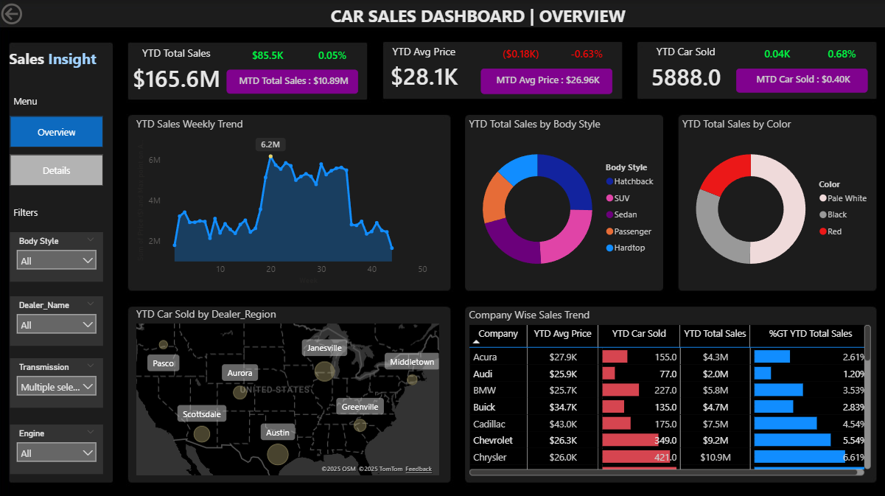
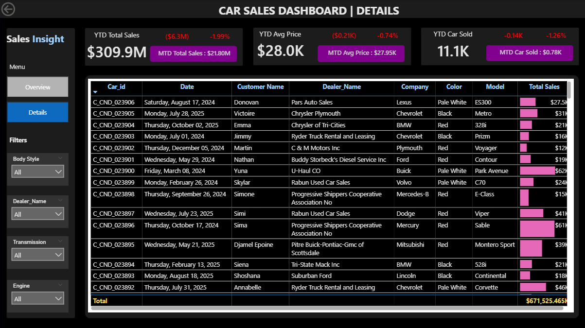

# 🚗 Car Sales Dashboard (Power BI)

An interactive **Power BI Dashboard** designed to analyze and visualize car sales performance across multiple dimensions — region, body style, color, and company.  
This project delivers deep insights into business KPIs and helps management track performance efficiently.



---

## 🍀 Problem Statement

The objective of this project is to create an analytical dashboard that provides actionable insights into **car sales trends and performance**.

---

### 🎯 Key Goals

- Compare **YTD, MTD, YOY, and PTYD** for:
  - Total Sales  
  - Average Price  
  - Cars Sold  
- Show **weekly and monthly sales trends**.  
- Provide visual analysis by **Body Style** and **Color**.  
- Display sales by **Dealer Region** on an interactive map.  
- Include a **Details page** with drill-through capabilities for each sale record.

📄 **Full Problem Description:**  
[📘 View Problem_Statement.pdf](docs/Problem_Statement.pdf)

---

## 📊 Dashboard Pages

| Page | Description |
|------|--------------|
| **Overview Page** | KPIs, sales trends, visuals by body style & color, dealer region map, and company sales breakdown. |
| **Details Page** | Interactive data table with filtering and sorting options (Car ID, Date, Dealer, Company, Model, Color, Sales). |



---

## ⚙️ Tools & Technologies

| Tool | Purpose |
|------|----------|
| **Power BI Desktop** | Dashboard creation and DAX calculations |
| **Microsoft Excel / CSV** | Data source |
| **Power Query Editor** | Data transformation and cleaning |
| **DAX** | Calculated measures for KPIs |

---

## 📁 Repository Structure

```bash
powerbi-car-sales-dashboard/
│
├─ data/
│   └─ car_sales_data.xlsx
│
├─ assets/
│   ├─ overview.png
│   └─ details.png
│
├─ docs/
│   └─ Problem_Statement.pdf
│
├─ Car-Sales-Dashboard.pbix
├─ README.md
├─ LICENSE
└─ .gitignore

```
---

## 📥 How to Use

1. **Clone or download** this repository.  
2. Open `Car-Sales-Dashboard.pbix` in **Power BI Desktop**.  
3. When prompted, update the file path to the local `data/` folder.  
4. Click **Refresh** to load visuals with the dataset.  
5. Explore KPIs, filters, and drill-through options interactively.

